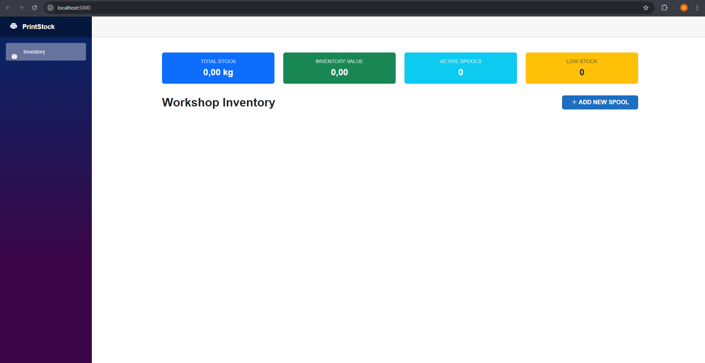
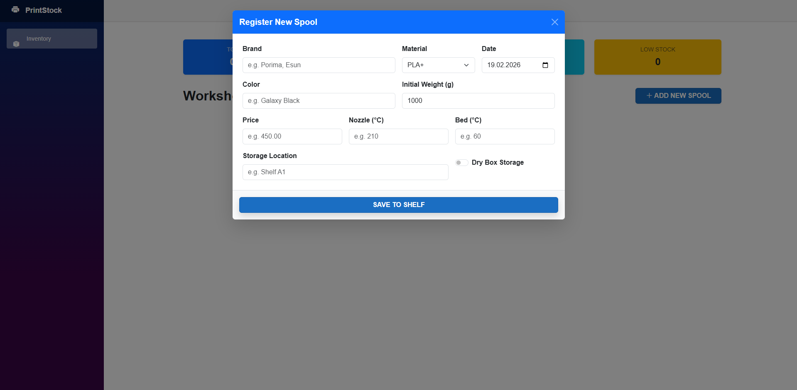

# PrintStock 🧵

**PrintStock** is a lightweight, portable, and modern inventory manager designed specifically for 3D printing enthusiasts and makers.

It runs locally on your machine with a browser-based interface, requiring **no installation**. Just download, extract, and run.



## 🚀 Features

* **⚡ Fully Portable:** Runs as a single `.exe` file without installation.
* **🌐 Modern UI:** Built with **Blazor WebAssembly** for a fast, responsive experience.
* **💾 Auto-Database:** Automatically creates and manages a local **SQLite** database. No setup required.
* **🛡️ Smart Logic:** Prevents physical impossibilities (e.g., adding 5kg to a 1kg spool).
* **📊 Real-time Stats:** Track total inventory value, remaining weights, and active spools instantly.
* **📏 Unit Conversion:** Supports both Gram (g) and Kilogram (kg) inputs seamlessly.
* **🌡️ Spool Details:** Store critical data like Bed Temp, Nozzle Temp, and Storage Location.

## 📦 Installation & Usage (For Users)

1.  Go to the [Releases](https://github.com/Endoplazmikmitokondri/PrintStock/releases) page.
2.  Download the latest **`PrintStock_v1.0_Portable.zip`** file.
3.  Extract the ZIP file to a folder.
4.  **⚠️ IMPORTANT:** Ensure `PrintStock.exe` and the `wwwroot` folder are in the same directory. Do not separate them.
5.  Double-click `PrintStock.exe`.
6.  A console window will appear (do not close it), and your default web browser will automatically open `http://localhost:5000`.

## 🛠️ Development (For Developers)

If you want to contribute or build the project from source:

### Prerequisites
* [.NET SDK](https://dotnet.microsoft.com/download) (Version 10.0 or newer)

### Getting Started

1.  **Clone the repository**
    ```bash
    git clone [https://github.com/Endoplazmikmitokondri/PrintStock.git](https://github.com/Endoplazmikmitokondri/PrintStock.git)
    cd PrintStock
    ```

2.  **Run the API (Backend & Host)**
    ```bash
    cd PrintStock.API
    dotnet run
    ```

3.  The application will automatically build the UI, migrate the database, and launch the browser.

## 🏗️ Tech Stack

* **Framework:** .NET 8 / 10 (C#)
* **Frontend:** Blazor WebAssembly (WASM)
* **Backend:** ASP.NET Core Web API
* **Database:** SQLite + Entity Framework Core
* **Styling:** Bootstrap 5

## 📸 Screenshots

| Dashboard Overview | Add New Spool |
|:---:|:---:|
|  |  |

## 🤝 Contributing

Contributions are welcome! Please feel free to submit a Pull Request.

1.  Fork the project.
2.  Create your feature branch (`git checkout -b feature/AmazingFeature`).
3.  Commit your changes (`git commit -m 'Add some AmazingFeature'`).
4.  Push to the branch (`git push origin feature/AmazingFeature`).
5.  Open a Pull Request.

## 📄 License

This project is licensed under the **MIT License** - see the [LICENSE](LICENSE) file for details.

---

<p align="center">
  Made with ❤️ by <b>Bora Ayvaz</b>
</p>
